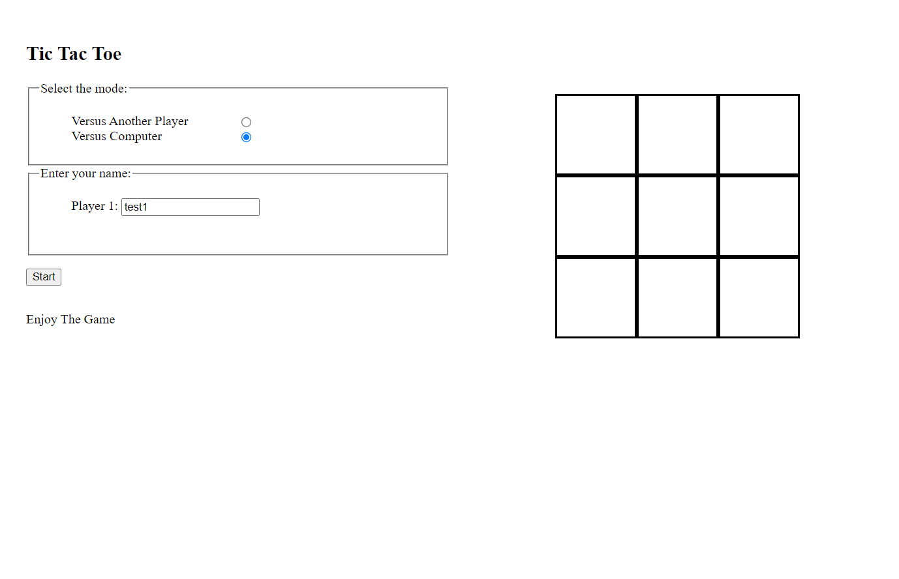

# tictactoe

Live Demo:
https://mfarid4.github.io/tictactoe

### Libraries
- MustacheJS

### Objectives

Build a tictactoe game with:
- 2 modes:
  - vs another player
  - vs computer
- implemented minimax for vs computer
- 3 button:
  -  start: initiate the game
  -  reset: reset the round
  -  new: restart the game with mode selection